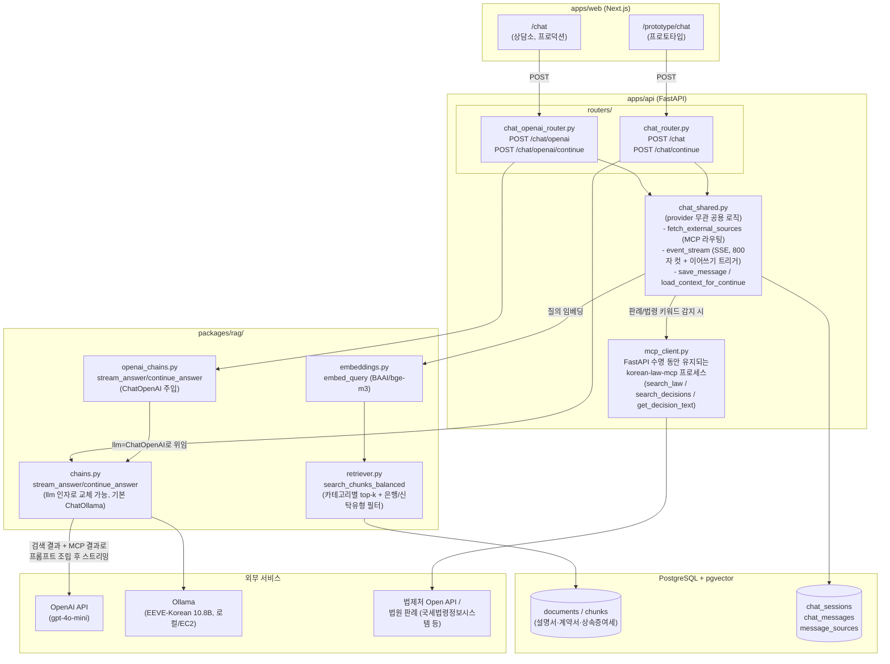
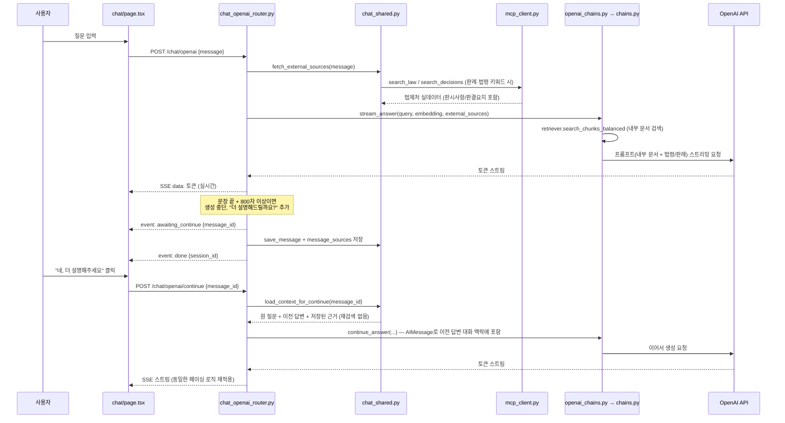

# RAG 챗봇 아키텍처 (2026-08-05 기준)

`/chat`(OpenAI)과 `/prototype/chat`(Ollama) 두 경로가 검색·MCP·DB 로직을 공유하고 LLM
호출부만 갈아끼우는 구조. 관련 문서: [RAG.md](./RAG.md), [260805.md](./260805.md),
[issue/FN-CORE-05-openai-rag-migration.md](./issue/FN-CORE-05-openai-rag-migration.md)

## 전체 구조

## 답변 스트리밍 · 이어쓰기 흐름

## 두 경로의 차이점 요약

| | `/chat` (프로덕션) | `/prototype/chat` (프로토타입) |
|---|---|---|
| 프론트 | `apps/web/src/app/chat/` | `apps/web/src/app/prototype/chat/` |
| 백엔드 라우터 | `chat_openai_router.py` | `chat_router.py` |
| LLM | OpenAI API (`gpt-4o-mini`) | Ollama (`EEVE-Korean-Instruct-10.8B`, Q4) |
| LLM 위치 | OpenAI 클라우드 | 로컬 또는 EC2 자체 호스팅 |
| 검색/MCP/DB | **완전히 동일** (`chat_shared.py`, `retriever.py`, `mcp_client.py`) | 좌동 |

## 알려진 제약

- Ollama 경로는 셀프호스팅 인스턴스의 RAM이 모델 크기(6.5GB)보다 커야 함 — 자세한 배포
  이력과 한계는 [260805.md](./260805.md) 참고
- korean-law-mcp는 법제처 API를 감싼 것이라 도메인(신탁/상속) 밖 질의는 키워드 추출이
  더 필요할 수 있음 (`chat_shared.py`의 `_extract_keywords`)
